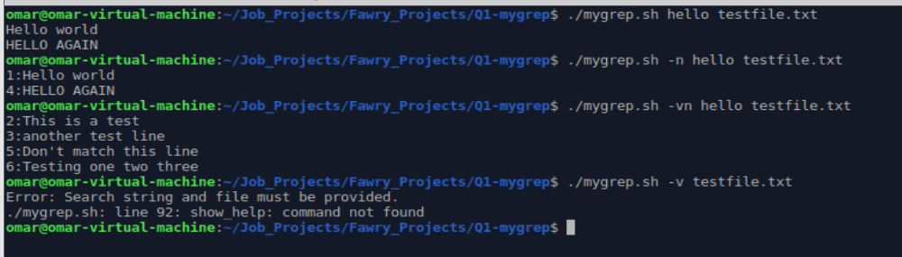

# MyGrep - Mini grep Implementation

📄 **Overview**  
This project is a custom lightweight version of the `grep` command called **mygrep.sh**.  
It allows searching for a string in a file with options such as showing line numbers, inverting matches, counting matches, and displaying filenames.

---
🔗 **[Note Reflective Section And Output Screenshot Are At the End]**

## 🚀 How to Run
First, ensure the script is executable:

```bash
chmod +x mygrep.sh
```

Then run it:

```bash
./mygrep.sh [options] "search_string" filename
```

## ⚙️ Options
| Option  | Description |
|---------|-------------|
| `-n`    | Show line numbers alongside matching lines. |
| `-v`    | Invert match (show lines that do **NOT** match). |
| `-c`    | Only count the number of matching lines. |
| `-l`    | Only print filename if a match is found. |
| `--help`| Display detailed usage instructions. |

## 📸 Example Usage

Basic search:

```bash
./mygrep.sh hello testfile.txt
```

Search showing line numbers:

```bash
./mygrep.sh -n hello testfile.txt
```

Invert match and show line numbers:

```bash
./mygrep.sh -vn hello testfile.txt
```

Invert match only:

```bash
./mygrep.sh -v hello testfile.txt
```

Count number of matches:

```bash
./mygrep.sh -c hello testfile.txt
```

Print filename if a match found:

```bash
./mygrep.sh -l hello testfile.txt
```

Show help message:

```bash
./mygrep.sh --help
```

**Result Screenshot:**



---

## 🧠 Reflective Section
### Handling Arguments and Options
The script uses `getopts` for flexible and clean parsing of command-line options. It sets appropriate flags during option parsing and validates arguments afterward. If missing, it shows clear error messages.

### Supporting Extensions
If regex support or additional options like case-insensitive search (`-i`) were required, the script would need changes inside the `search_in_line` function, perhaps integrating regex tools.

### Most Difficult Part
The most challenging aspect was handling `getopts` correctly, especially ensuring all the flags interact smoothly and coordinating multiple script sections together.

---

## 📂 Folder Structure

```
.
├── mygrep.sh                   # Main Script
├── testfile.txt                # File for Testing
├── Screenshot_Of_Outputs.png   # Test Evidence
├── README.md                   # This Documentation

---

